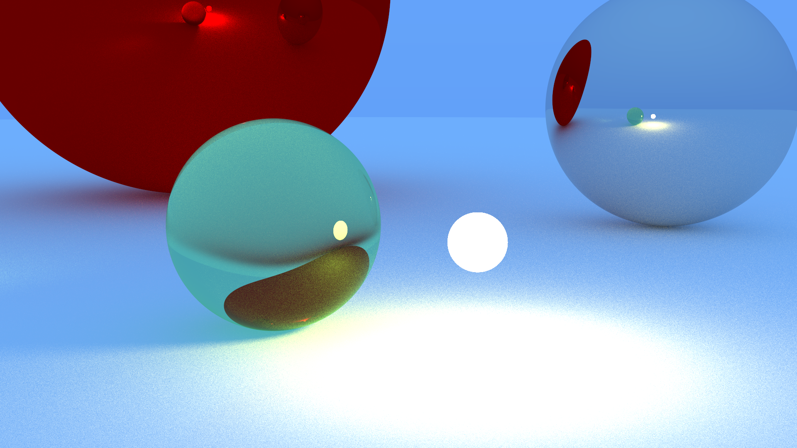

# Raytracer

A simple raytracer written in Rust.



## Features

- **Diffuse materials** - matte surfaces with Lambertian scattering
- **Metal materials** - reflective surfaces with adjustable fuzziness
- **Dielectric materials** - transparent glass with refraction and Fresnel effects
- **Emissive materials** - light sources
- **Antialiasing** - multisampling per pixel
- **Parallel rendering** - leverages all CPU cores with [rayon](https://github.com/rayon-rs/rayon)
- **Perspective camera** - configurable field of view and positioning

## Building & Running

```bash
cargo build --release
cargo run --release > img.ppm
```

Convert to PNG (requires ffmpeg or ImageMagick):

```bash
ffmpeg -i img.ppm img.png
# or
convert img.ppm img.png
```

## Configuration

Edit `main.rs` to customize:

- `image_width` / `image_height` - resolution
- `samples_per_pixel` - antialiasing quality (higher = smoother, slower)
- `depth` - max ray bounces (affects render time)
- `camera` - position, look-at point, field of view
- `objects` - scene geometry and materials

## Materials

- **Diffuse**: Matte surfaces. Takes `albedo` (color).
- **Reflective**: Shiny metals. Takes `albedo` and `fuzz` (0 = perfect mirror, >0 = rough).
- **Dielectric**: Glass/transparent. Takes `albedo` and `refractive_index` (1.5 for glass).
- **Light**: Emissive. Takes `color` and `intensity`.

## Performance Tips

- Use `--release` mode (much faster)
- Reduce `image_width` or `samples_per_pixel` for quick iterations
- Increase `RUSTFLAGS="-C target-cpu=native"` for CPU-specific optimizations

## License

MIT
